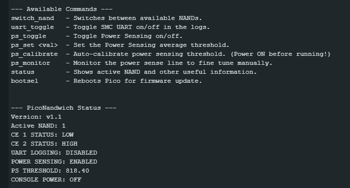

# PicoNandwich (v1.1 UPDATE)
PicoNandwich is a dual nand solution for the Xbox 360 that uses a Raspberry Pi Pico for nand switching (and other features).

### Pinout/Wiring
Both CE points must be pulled HIGH to 3.3v with a resistor inline. (Tested both 3.3k and 10k, both work fine.)
|Pico|Console|Info|
|--|--|--|
|GPIO 0|BUZZER +|Speaker/Buzzer Positive (optional)|
|GPIO 1|ROL LED POINT|Goes to spare pin on RF board connector for LED (optional, but recommended)|
|GND|BUZZER -|Speaker/Buzzer Negative (optional)|
|GPIO 2|SYNC POINT|Goes to sync pin on RF board connector|
|GPIO 3|NAND 1 CE|Nand 1 Chip Enable|
|GPIO 4|NAND 2 CE|Nand 2 Chip Enable|
|GPIO 28 -> GPIO 17|UART TX|Bridge GP28 and 17, used for UART and Power Sensing (optional, but recommended)|
|VSYS|5V or 3.3V Standby|Power to the pico even when console is off|
|GND|Console GND|obvious|

### How To Use

 - Hold the sync button briefly, LED/Buzzer will indicate which NAND is selected by lighting up or beeping one, two, three or four times depending on the setup. 
 - Hold the sync button for around 8 seconds to put the Pico into BOOTSEL/bootloader mode. Pico will flash 3 times with a long beep. (If you don't have access to the Pico's physical button, do NOT turn off the console or unplug the cable since this will wipe the firmware and you will have no way to write the firmware back to the Pico without opening your console.)

### Quality of Life Features
 - **Persistent Config** - Saves all settings and active nand between power cycles.
 - **Serial Console** - Configure your PicoNandwich and get information.
 - **UART Passthrough** - View your console's UART/Debug output.
 - **Power Sensing** - Detect if the console is powered on and prevent nand switching. (***Disabled By Default***)
 - **PS Calibrate** -  Auto Calibrates power sensing threshold. (***Needed, values can vary from console to console and wiring***)
  - **BOOTSEL Mode** - Reflash the Pico's firmware while installed in the console (***USB must be plugged in***)
 - **LED** - While standard on dual nand consoles, ill mention it anyways. Wire an ROL LED to the pico.
 - **Buzzer/Speaker** - Wire up a buzzer/speaker for audio feedback. (cause why not?)

https://github.com/user-attachments/assets/00d4de92-12ca-4c38-94c6-d7ae0058b440

### Serial Features
This firmware contains Serial features as well. You will use this to configure power sensing. You can also use it to send other various commands to the pico, view pico/nand status and view your console's UART output.

**Calibrating Power Sense**

 1. Plug USB into PC and run your serial software of choice; something that can send commands.
 2. Select correct COM port and set baud rate to 115200.
 3. Run "help" to see all available commands, we are looking for `ps_toggle`; run that command.
 4. To calibrate automatically, power your console on and then run the `ps_calibrate` command.
 5. To test, power off your console and try to switch nands (or check status), it should work. Now turn your console on, nand switching should no longer work while console is turned on and status command should show console as on.

***Note**: if your console doesnt boot straight away, check your wiring and then disable PS and calibrate it manually using `ps_monitor` and `ps_set`. `ps_set` should be at just below the average number `ps_monitor` gives you.*

### ***Some Disclaimers***
I am NOT responsible for any bricked consoles or corrupted NANDs or console bans from doing this install! Power sensing works but is imperfect, so please do **NOT** hotswap NANDs if you don't know what you are doing.

I **DO NOT** recommend powering the console while connected to a PC under normal circumstances. This risks backfeeding your console from the PC's USB port. Typically the Pico has protection against this, but not when voltages over USB and the VSYS pin are drastically different. 
If you do this, make sure to have the proper protections (like a diode) in place. (Do this if you're using serial features too.)

^^ You can do this without added protection, this is what i have done myself. But I am not responsible for any damage that may or may not be caused to your console/pico.
